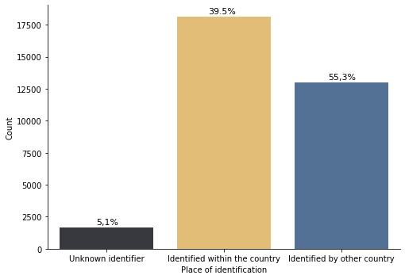

## Food hazards from around the world 


```python
# we will first import all necessary libraries
import pandas as pd
import os
import chart_studio
import chart_studio.plotly as py
import numpy as np
#import glob
import plotly.express as px
from datetime import datetime
import geopandas as gpd
import matplotlib.pyplot as plt
import seaborn as sns
#import plotly.express as px
from shapely.geometry import Point, LineString
#from mpl_toolkits.basemap import Basemap
#import osmnx as ox
#import networkx as nx
import matplotlib as mpl
#from networkx.algorithms import bipartite as bi
#import matplotlib.gridspec as gridspec
#from scipy.stats import spearmanr
#import folium
#import mplleaflet

#from legendgram import legendgram
import mapclassify as mf
#import palettable as pal

wgs84 = {'init':'EPSG:4326'}
bng = {'init':'EPSG:27700'}
```


```python
username = 'lenkahas' # your username
api_key = 'l230Jjqz6EtzJhYvG2ES' # your api key - go to profile > settings > regenerate key
chart_studio.tools.set_credentials_file(username=username, api_key=api_key)
```


```python
# defne the path
file = './../../data/food hazard/FSA_data_competition_2020.csv'
# read the flow file
data = pd.read_csv(file, index_col=None)
```

    C:\Users\tk18583\AppData\Local\Continuum\anaconda3\envs\geo2\lib\site-packages\IPython\core\interactiveshell.py:3145: DtypeWarning: Columns (0,14,19,20) have mixed types.Specify dtype option on import or set low_memory=False.
      has_raised = await self.run_ast_nodes(code_ast.body, cell_name,
    


```python
data['loop'] = np.where((data['Country of Origin'] == data['Notified by']), 'Yes', 'No')
data['na'] = np.where((data['Country of Origin'].isna() |data['Notified by'].isna()), 'Yes', 'No')

data['class'] = 'Identified by other country'
data['class'][data['loop'] == 'Yes'] = 'Identified within the country'
data['class'][data['na'] == 'Yes'] = 'Unknown identifier'

data['class'].value_counts(normalize = True)
```


    Identified within the country    0.553321
    Identified by other country      0.395661
    Unknown identifier               0.051018
    Name: class, dtype: float64


```python
ax = sns.catplot(x="class", kind="count",palette=['#36393f','#f3c366','#4870a0'], data=data, height=5, aspect=1.4)
ax.fig.text(0.22, 0.20,'5,1%', fontsize=11) 
ax.fig.text(0.50, 0.94,'39.5%', fontsize=11) 
ax.fig.text(0.80, 0.71,'55,3%', fontsize=11)
ax.set(xlabel='Place of identification', ylabel='Count');
#ax.set_xticklabels(rotation=20);
plt.savefig( './../../data/food hazard/graph1.png', transparent=True)
```





```python
f1 = data.loc[:,['class','Country of Origin', 'ID']].groupby(['class', 'Country of Origin']).count().reset_index()
f2 = data.loc[:,['class','Notified by', 'ID']].groupby(['class', 'Notified by']).count().reset_index()
```


```python
fig = px.bar(f1, x="ID", y="Country of Origin", color="class",  title="Sources of food hazard", width=1100, height=3000, color_discrete_sequence =['#4870a0','#f3c366','#36393f'], labels = {'ID':'Number of food hazards','Country of Origin': 'Source Country'})
fig.update_layout({'plot_bgcolor': 'rgba(0, 0, 0, 0)','paper_bgcolor': 'rgba(0, 0, 0, 0)',
'barmode':'stack', 'yaxis':{'categoryorder':'total ascending'}})
fig.show()
```


<div>


            <div id="c87c9838-e2b8-46eb-8fb9-4e741da4c19f" class="plotly-graph-div" style="height:3000px; width:1100px;"></div>
            <script type="text/javascript">
                require(["plotly"], function(Plotly) {
                    window.PLOTLYENV=window.PLOTLYENV || {};

                if (document.getElementById("c87c9838-e2b8-46eb-8fb9-4e741da4c19f")) {
                    Plotly.newPlot(
                        'c87c9838-e2b8-46eb-8fb9-4e741da4c19f',
                        [{"alignmentgroup": "True", "hovertemplate": "class=Identified by other country<br>Number of food hazards=%{x}<br>Source Country=%{y}<extra></extra>", "legendgroup": "Identified by other country", "marker": {"color": "#4870a0"}, "name": "Identified by other country", "offsetgroup": "Identified by other country", "orientation": "h", "showlegend": true, "textposition": "auto", "type": "bar", "x": [6, 20, 18, 1, 1, 124, 73, 64, 4, 38, 1, 9, 169, 2, 8, 6, 13, 669, 1, 37, 14, 10, 7, 240, 6, 1, 122, 1394, 26, 6, 22, 2, 6, 86, 89, 54, 85, 118, 3, 19, 50, 1, 3, 2, 15, 523, 2, 25, 370, 106, 31, 1, 5, 4, 1, 1, 4, 31, 107, 5, 26, 633, 112, 70, 66, 29, 394, 4, 29, 15, 4, 13, 1, 37, 30, 42, 2, 45, 6, 9, 7, 63, 4, 27, 11, 67, 7, 1, 1, 103, 9, 22, 16, 2, 339, 38, 3, 2, 160, 27, 3, 54, 6, 15, 4, 9, 48, 107, 682, 73, 51, 101, 8, 30, 34, 9, 20, 26, 22, 1, 51, 98, 605, 60, 199, 6, 1, 48, 27, 39, 67, 3, 12, 428, 1, 55, 842, 761, 60, 92, 6, 289, 44, 35, 55, 440, 1, 2], "xaxis": "x", "y": ["Afghanistan", "Albania", "Algeria", "Andorra", "Angola", "Argentina", "Australia", "Austria", "Azerbaijan", "Bangladesh", "Barbados", "Belarus", "Belgium", "Belize", "Benin", "Bolivia", "Bosnia Herzegovina", "Brazil", "Brunei", "Bulgaria", "Burkina Faso", "Cambodia", "Cameroon", "Canada", "Cape Verde", "Chad", "Chile", "China", "Colombia", "Costa Rica", "Croatia", "Cuba", "Cyprus", "Czech Republic", "Denmark", "Dominican Republic", "Ecuador", "Egypt", "El Salvador", "Estonia", "Ethiopia", "Falkland Islands", "Faroe Islands", "Fiji", "Finland", "France", "Gambia", "Georgia", "Germany", "Ghana", "Greece", "Greenland", "Guatemala", "Guinea", "Guinea Bissau", "Guyana", "Honduras", "Hong Kong", "Hungary", "INFOSAN", "Iceland", "India", "Indonesia", "Iran", "Ireland", "Israel", "Italy", "Ivory Coast", "Japan", "Jordan", "Kazakhstan", "Kenya", "Kosovo", "Laos", "Latvia", "Lebanon", "Lesotho", "Lithuania", "Luxembourg", "Macedonia", "Madagascar", "Malaysia", "Maldives", "Mauritania", "Mauritius", "Mexico", "Moldova", "Mongolia", "Montenegro", "Morocco", "Mozambique", "Myanmar", "Namibia", "Nepal", "Netherlands", "New Zealand", "Nicaragua", "Niger", "Nigeria", "Norway", "Oman", "Pakistan", "Palestinian Territories", "Panama", "Papua New Guinea", "Paraguay", "Peru", "Philippines", "Poland", "Portugal", "Romania", "Russia", "Saudi Arabia", "Senegal", "Serbia", "Seychelles", "Singapore", "Slovakia", "Slovenia", "Solomon Islands", "South Africa", "South Korea", "Spain", "Sri Lanka", "Sudan", "Suriname", "Swaziland", "Sweden", "Switzerland", "Syria", "Taiwan", "Tajikistan", "Tanzania", "Thailand", "Trinidad and Tobago", "Tunisia", "Turkey", "USA", "Uganda", "Ukraine", "United Arab Emirates", "United Kingdom", "Uruguay", "Uzbekistan", "Venezuela", "Vietnam", "Yemen", "Zimbabwe"], "yaxis": "y"}, {"alignmentgroup": "True", "hovertemplate": "class=Identified within the country<br>Number of food hazards=%{x}<br>Source Country=%{y}<extra></extra>", "legendgroup": "Identified within the country", "marker": {"color": "#f3c366"}, "name": "Identified within the country", "offsetgroup": "Identified within the country", "orientation": "h", "showlegend": true, "textposition": "auto", "type": "bar", "x": [36, 307, 91, 900, 4, 6187, 33, 1, 28, 402, 5, 36, 1276, 441, 6, 130, 118, 120, 66, 79, 754, 3, 11, 171, 115, 511, 236, 9, 165, 207, 5, 8, 157, 82, 173, 42, 123, 3435, 1661], "xaxis": "x", "y": ["Argentina", "Australia", "Austria", "Belgium", "Bulgaria", "Canada", "Croatia", "Cyprus", "Czech Republic", "Denmark", "Estonia", "Finland", "France", "Germany", "Greece", "Hong Kong", "Hungary", "Iceland", "Ireland", "Israel", "Italy", "Japan", "Lithuania", "Luxembourg", "Malta", "Netherlands", "New Zealand", "Nigeria", "Norway", "Poland", "Portugal", "Romania", "Slovakia", "Slovenia", "Spain", "Sweden", "Switzerland", "USA", "United Kingdom"], "yaxis": "y"}, {"alignmentgroup": "True", "hovertemplate": "class=Unknown identifier<br>Number of food hazards=%{x}<br>Source Country=%{y}<extra></extra>", "legendgroup": "Unknown identifier", "marker": {"color": "#36393f"}, "name": "Unknown identifier", "offsetgroup": "Unknown identifier", "orientation": "h", "showlegend": true, "textposition": "auto", "type": "bar", "x": [2, 22, 3, 1, 2, 9, 82, 5, 6, 1, 6, 3, 2, 38, 2, 5, 6, 1, 3, 1, 6, 6, 2, 4, 1, 1, 1, 1, 1, 2, 22, 1, 1, 1, 7, 1, 6, 1, 1, 2, 4, 4, 2, 1, 21, 3, 13, 10, 2, 2, 2, 13, 573, 2, 23, 1, 11], "xaxis": "x", "y": ["Argentina", "Australia", "Austria", "Bangladesh", "Belgium", "Brazil", "Canada", "Chile", "China", "Costa Rica", "Denmark", "Egypt", "Estonia", "France", "Gabon", "Georgia", "Germany", "Hungary", "Iceland", "Iran", "Ireland", "Israel", "Italy", "Japan", "Jordan", "Kenya", "Lithuania", "Luxembourg", "Malaysia", "Malta", "Mexico", "Morocco", "Myanmar", "Netherlands", "New Zealand", "Nigeria", "Norway", "Palestinian Territories", "Peru", "Philippines", "Poland", "Russia", "Singapore", "Slovenia", "South Africa", "South Korea", "Spain", "Sweden", "Switzerland", "Thailand", "Tunisia", "Turkey", "USA", "Uganda", "United Kingdom", "Venezuela", "Vietnam"], "yaxis": "y"}],
                        {"barmode": "stack", "height": 3000, "legend": {"title": {"text": "class"}, "tracegroupgap": 0}, "paper_bgcolor": "rgba(0, 0, 0, 0)", "plot_bgcolor": "rgba(0, 0, 0, 0)", "template": {"data": {"bar": [{"error_x": {"color": "#2a3f5f"}, "error_y": {"color": "#2a3f5f"}, "marker": {"line": {"color": "#E5ECF6", "width": 0.5}}, "type": "bar"}], "barpolar": [{"marker": {"line": {"color": "#E5ECF6", "width": 0.5}}, "type": "barpolar"}], "carpet": [{"aaxis": {"endlinecolor": "#2a3f5f", "gridcolor": "white", "linecolor": "white", "minorgridcolor": "white", "startlinecolor": "#2a3f5f"}, "baxis": {"endlinecolor": "#2a3f5f", "gridcolor": "white", "linecolor": "white", "minorgridcolor": "white", "startlinecolor": "#2a3f5f"}, "type": "carpet"}], "choropleth": [{"colorbar": {"outlinewidth": 0, "ticks": ""}, "type": "choropleth"}], "contour": [{"colorbar": {"outlinewidth": 0, "ticks": ""}, "colorscale": [[0.0, "#0d0887"], [0.1111111111111111, "#46039f"], [0.2222222222222222, "#7201a8"], [0.3333333333333333, "#9c179e"], [0.4444444444444444, "#bd3786"], [0.5555555555555556, "#d8576b"], [0.6666666666666666, "#ed7953"], [0.7777777777777778, "#fb9f3a"], [0.8888888888888888, "#fdca26"], [1.0, "#f0f921"]], "type": "contour"}], "contourcarpet": [{"colorbar": {"outlinewidth": 0, "ticks": ""}, "type": "contourcarpet"}], "heatmap": [{"colorbar": {"outlinewidth": 0, "ticks": ""}, "colorscale": [[0.0, "#0d0887"], [0.1111111111111111, "#46039f"], [0.2222222222222222, "#7201a8"], [0.3333333333333333, "#9c179e"], [0.4444444444444444, "#bd3786"], [0.5555555555555556, "#d8576b"], [0.6666666666666666, "#ed7953"], [0.7777777777777778, "#fb9f3a"], [0.8888888888888888, "#fdca26"], [1.0, "#f0f921"]], "type": "heatmap"}], "heatmapgl": [{"colorbar": {"outlinewidth": 0, "ticks": ""}, "colorscale": [[0.0, "#0d0887"], [0.1111111111111111, "#46039f"], [0.2222222222222222, "#7201a8"], [0.3333333333333333, "#9c179e"], [0.4444444444444444, "#bd3786"], [0.5555555555555556, "#d8576b"], [0.6666666666666666, "#ed7953"], [0.7777777777777778, "#fb9f3a"], [0.8888888888888888, "#fdca26"], [1.0, "#f0f921"]], "type": "heatmapgl"}], "histogram": [{"marker": {"colorbar": {"outlinewidth": 0, "ticks": ""}}, "type": "histogram"}], "histogram2d": [{"colorbar": {"outlinewidth": 0, "ticks": ""}, "colorscale": [[0.0, "#0d0887"], [0.1111111111111111, "#46039f"], [0.2222222222222222, "#7201a8"], [0.3333333333333333, "#9c179e"], [0.4444444444444444, "#bd3786"], [0.5555555555555556, "#d8576b"], [0.6666666666666666, "#ed7953"], [0.7777777777777778, "#fb9f3a"], [0.8888888888888888, "#fdca26"], [1.0, "#f0f921"]], "type": "histogram2d"}], "histogram2dcontour": [{"colorbar": {"outlinewidth": 0, "ticks": ""}, "colorscale": [[0.0, "#0d0887"], [0.1111111111111111, "#46039f"], [0.2222222222222222, "#7201a8"], [0.3333333333333333, "#9c179e"], [0.4444444444444444, "#bd3786"], [0.5555555555555556, "#d8576b"], [0.6666666666666666, "#ed7953"], [0.7777777777777778, "#fb9f3a"], [0.8888888888888888, "#fdca26"], [1.0, "#f0f921"]], "type": "histogram2dcontour"}], "mesh3d": [{"colorbar": {"outlinewidth": 0, "ticks": ""}, "type": "mesh3d"}], "parcoords": [{"line": {"colorbar": {"outlinewidth": 0, "ticks": ""}}, "type": "parcoords"}], "pie": [{"automargin": true, "type": "pie"}], "scatter": [{"marker": {"colorbar": {"outlinewidth": 0, "ticks": ""}}, "type": "scatter"}], "scatter3d": [{"line": {"colorbar": {"outlinewidth": 0, "ticks": ""}}, "marker": {"colorbar": {"outlinewidth": 0, "ticks": ""}}, "type": "scatter3d"}], "scattercarpet": [{"marker": {"colorbar": {"outlinewidth": 0, "ticks": ""}}, "type": "scattercarpet"}], "scattergeo": [{"marker": {"colorbar": {"outlinewidth": 0, "ticks": ""}}, "type": "scattergeo"}], "scattergl": [{"marker": {"colorbar": {"outlinewidth": 0, "ticks": ""}}, "type": "scattergl"}], "scattermapbox": [{"marker": {"colorbar": {"outlinewidth": 0, "ticks": ""}}, "type": "scattermapbox"}], "scatterpolar": [{"marker": {"colorbar": {"outlinewidth": 0, "ticks": ""}}, "type": "scatterpolar"}], "scatterpolargl": [{"marker": {"colorbar": {"outlinewidth": 0, "ticks": ""}}, "type": "scatterpolargl"}], "scatterternary": [{"marker": {"colorbar": {"outlinewidth": 0, "ticks": ""}}, "type": "scatterternary"}], "surface": [{"colorbar": {"outlinewidth": 0, "ticks": ""}, "colorscale": [[0.0, "#0d0887"], [0.1111111111111111, "#46039f"], [0.2222222222222222, "#7201a8"], [0.3333333333333333, "#9c179e"], [0.4444444444444444, "#bd3786"], [0.5555555555555556, "#d8576b"], [0.6666666666666666, "#ed7953"], [0.7777777777777778, "#fb9f3a"], [0.8888888888888888, "#fdca26"], [1.0, "#f0f921"]], "type": "surface"}], "table": [{"cells": {"fill": {"color": "#EBF0F8"}, "line": {"color": "white"}}, "header": {"fill": {"color": "#C8D4E3"}, "line": {"color": "white"}}, "type": "table"}]}, "layout": {"annotationdefaults": {"arrowcolor": "#2a3f5f", "arrowhead": 0, "arrowwidth": 1}, "coloraxis": {"colorbar": {"outlinewidth": 0, "ticks": ""}}, "colorscale": {"diverging": [[0, "#8e0152"], [0.1, "#c51b7d"], [0.2, "#de77ae"], [0.3, "#f1b6da"], [0.4, "#fde0ef"], [0.5, "#f7f7f7"], [0.6, "#e6f5d0"], [0.7, "#b8e186"], [0.8, "#7fbc41"], [0.9, "#4d9221"], [1, "#276419"]], "sequential": [[0.0, "#0d0887"], [0.1111111111111111, "#46039f"], [0.2222222222222222, "#7201a8"], [0.3333333333333333, "#9c179e"], [0.4444444444444444, "#bd3786"], [0.5555555555555556, "#d8576b"], [0.6666666666666666, "#ed7953"], [0.7777777777777778, "#fb9f3a"], [0.8888888888888888, "#fdca26"], [1.0, "#f0f921"]], "sequentialminus": [[0.0, "#0d0887"], [0.1111111111111111, "#46039f"], [0.2222222222222222, "#7201a8"], [0.3333333333333333, "#9c179e"], [0.4444444444444444, "#bd3786"], [0.5555555555555556, "#d8576b"], [0.6666666666666666, "#ed7953"], [0.7777777777777778, "#fb9f3a"], [0.8888888888888888, "#fdca26"], [1.0, "#f0f921"]]}, "colorway": ["#636efa", "#EF553B", "#00cc96", "#ab63fa", "#FFA15A", "#19d3f3", "#FF6692", "#B6E880", "#FF97FF", "#FECB52"], "font": {"color": "#2a3f5f"}, "geo": {"bgcolor": "white", "lakecolor": "white", "landcolor": "#E5ECF6", "showlakes": true, "showland": true, "subunitcolor": "white"}, "hoverlabel": {"align": "left"}, "hovermode": "closest", "mapbox": {"style": "light"}, "paper_bgcolor": "white", "plot_bgcolor": "#E5ECF6", "polar": {"angularaxis": {"gridcolor": "white", "linecolor": "white", "ticks": ""}, "bgcolor": "#E5ECF6", "radialaxis": {"gridcolor": "white", "linecolor": "white", "ticks": ""}}, "scene": {"xaxis": {"backgroundcolor": "#E5ECF6", "gridcolor": "white", "gridwidth": 2, "linecolor": "white", "showbackground": true, "ticks": "", "zerolinecolor": "white"}, "yaxis": {"backgroundcolor": "#E5ECF6", "gridcolor": "white", "gridwidth": 2, "linecolor": "white", "showbackground": true, "ticks": "", "zerolinecolor": "white"}, "zaxis": {"backgroundcolor": "#E5ECF6", "gridcolor": "white", "gridwidth": 2, "linecolor": "white", "showbackground": true, "ticks": "", "zerolinecolor": "white"}}, "shapedefaults": {"line": {"color": "#2a3f5f"}}, "ternary": {"aaxis": {"gridcolor": "white", "linecolor": "white", "ticks": ""}, "baxis": {"gridcolor": "white", "linecolor": "white", "ticks": ""}, "bgcolor": "#E5ECF6", "caxis": {"gridcolor": "white", "linecolor": "white", "ticks": ""}}, "title": {"x": 0.05}, "xaxis": {"automargin": true, "gridcolor": "white", "linecolor": "white", "ticks": "", "title": {"standoff": 15}, "zerolinecolor": "white", "zerolinewidth": 2}, "yaxis": {"automargin": true, "gridcolor": "white", "linecolor": "white", "ticks": "", "title": {"standoff": 15}, "zerolinecolor": "white", "zerolinewidth": 2}}}, "title": {"text": "Sources of food hazard"}, "width": 1100, "xaxis": {"anchor": "y", "domain": [0.0, 1.0], "title": {"text": "Number of food hazards"}}, "yaxis": {"anchor": "x", "categoryorder": "total ascending", "domain": [0.0, 1.0], "title": {"text": "Source Country"}}},
                        {"responsive": true}
                    ).then(function(){

var gd = document.getElementById('c87c9838-e2b8-46eb-8fb9-4e741da4c19f');
var x = new MutationObserver(function (mutations, observer) {{
        var display = window.getComputedStyle(gd).display;
        if (!display || display === 'none') {{
            console.log([gd, 'removed!']);
            Plotly.purge(gd);
            observer.disconnect();
        }}
}});

// Listen for the removal of the full notebook cells
var notebookContainer = gd.closest('#notebook-container');
if (notebookContainer) {{
    x.observe(notebookContainer, {childList: true});
}}

// Listen for the clearing of the current output cell
var outputEl = gd.closest('.output');
if (outputEl) {{
    x.observe(outputEl, {childList: true});
}}

                        })
                };
                });
            </script>
        </div>


```python
py.plot(fig, filename = 'graph_plotly1',auto_open=True)
```


    'https://plotly.com/~lenkahas/1/'


```python
import plotly.io as pio
import chart_studio.tools as tls

```


```python
# pio.write_html(fig, file='plotly_graph1.html', auto_open=True,  include_plotlyjs=True)
tls.get_embed('https://plotly.com/~lenkahas/1/') 
```


    '<iframe id="igraph" scrolling="no" style="border:none;" seamless="seamless" src="https://plotly.com/~lenkahas/1.embed" height="525" width="100%"></iframe>'


with open('plotly_graph1.html', 'w') as f:
    f.write(fig.to_html(include_plotlyjs='cdn'))


```python
fig = px.bar(f2, x="ID", y="Notified by", color="class", title="Food hazard Identification", width=1100, height=1000, color_discrete_sequence =['#4870a0','#f3c366','#36393f'], labels = {'ID':'Number of food hazards','Country of Origin': 'Country of identification'})
fig.update_layout({'plot_bgcolor': 'rgba(0, 0, 0, 0)','paper_bgcolor': 'rgba(0, 0, 0, 0)',
'barmode':'stack', 'yaxis':{'categoryorder':'total ascending'}})
fig.show()
```


<div>


            <div id="1bc601dd-f7c5-474f-b275-2937864ac1e3" class="plotly-graph-div" style="height:1000px; width:1100px;"></div>
            <script type="text/javascript">
                require(["plotly"], function(Plotly) {
                    window.PLOTLYENV=window.PLOTLYENV || {};

                if (document.getElementById("1bc601dd-f7c5-474f-b275-2937864ac1e3")) {
                    Plotly.newPlot(
                        '1bc601dd-f7c5-474f-b275-2937864ac1e3',
                        [{"alignmentgroup": "True", "hovertemplate": "class=Identified by other country<br>Number of food hazards=%{x}<br>Notified by=%{y}<extra></extra>", "legendgroup": "Identified by other country", "marker": {"color": "#4870a0"}, "name": "Identified by other country", "offsetgroup": "Identified by other country", "orientation": "h", "showlegend": true, "textposition": "auto", "type": "bar", "x": [7, 38, 202, 459, 410, 118, 5, 125, 82, 261, 368, 68, 256, 578, 1151, 416, 21, 120, 10, 167, 2, 1331, 1835, 118, 195, 45, 76, 964, 8, 3, 181, 329, 126, 50, 138, 108, 609, 434, 151, 314, 1088], "xaxis": "x", "y": ["Argentina", "Australia", "Austria", "Belgium", "Bulgaria", "Canada", "Commission Services", "Croatia", "Cyprus", "Czech Republic", "Denmark", "Estonia", "Finland", "France", "Germany", "Greece", "Hong Kong", "Hungary", "Iceland", "Ireland", "Israel", "Italy", "Japan", "Latvia", "Lithuania", "Luxembourg", "Malta", "Netherlands", "New Zealand", "Nigeria", "Norway", "Poland", "Portugal", "Romania", "Slovakia", "Slovenia", "Spain", "Sweden", "Switzerland", "USA", "United Kingdom"], "yaxis": "y"}, {"alignmentgroup": "True", "hovertemplate": "class=Identified within the country<br>Number of food hazards=%{x}<br>Notified by=%{y}<extra></extra>", "legendgroup": "Identified within the country", "marker": {"color": "#f3c366"}, "name": "Identified within the country", "offsetgroup": "Identified within the country", "orientation": "h", "showlegend": true, "textposition": "auto", "type": "bar", "x": [36, 307, 91, 900, 4, 6187, 33, 1, 28, 402, 5, 36, 1276, 441, 6, 130, 118, 120, 66, 79, 754, 3, 11, 171, 115, 511, 236, 9, 165, 207, 5, 8, 157, 82, 173, 42, 123, 3435, 1661], "xaxis": "x", "y": ["Argentina", "Australia", "Austria", "Belgium", "Bulgaria", "Canada", "Croatia", "Cyprus", "Czech Republic", "Denmark", "Estonia", "Finland", "France", "Germany", "Greece", "Hong Kong", "Hungary", "Iceland", "Ireland", "Israel", "Italy", "Japan", "Lithuania", "Luxembourg", "Malta", "Netherlands", "New Zealand", "Nigeria", "Norway", "Poland", "Portugal", "Romania", "Slovakia", "Slovenia", "Spain", "Sweden", "Switzerland", "USA", "United Kingdom"], "yaxis": "y"}, {"alignmentgroup": "True", "hovertemplate": "class=Unknown identifier<br>Number of food hazards=%{x}<br>Notified by=%{y}<extra></extra>", "legendgroup": "Unknown identifier", "marker": {"color": "#36393f"}, "name": "Unknown identifier", "offsetgroup": "Unknown identifier", "orientation": "h", "showlegend": true, "textposition": "auto", "type": "bar", "x": [6, 10, 4, 6, 7, 15, 2, 4, 3, 3, 44, 12, 1, 1, 2, 2, 1, 2, 23, 8, 17], "xaxis": "x", "y": ["Austria", "Belgium", "Croatia", "Cyprus", "Czech Republic", "Denmark", "Estonia", "Finland", "France", "Germany", "Ireland", "Japan", "Malta", "Netherlands", "Norway", "Poland", "Slovenia", "Spain", "Sweden", "Switzerland", "United Kingdom"], "yaxis": "y"}],
                        {"barmode": "stack", "height": 1000, "legend": {"title": {"text": "class"}, "tracegroupgap": 0}, "paper_bgcolor": "rgba(0, 0, 0, 0)", "plot_bgcolor": "rgba(0, 0, 0, 0)", "template": {"data": {"bar": [{"error_x": {"color": "#2a3f5f"}, "error_y": {"color": "#2a3f5f"}, "marker": {"line": {"color": "#E5ECF6", "width": 0.5}}, "type": "bar"}], "barpolar": [{"marker": {"line": {"color": "#E5ECF6", "width": 0.5}}, "type": "barpolar"}], "carpet": [{"aaxis": {"endlinecolor": "#2a3f5f", "gridcolor": "white", "linecolor": "white", "minorgridcolor": "white", "startlinecolor": "#2a3f5f"}, "baxis": {"endlinecolor": "#2a3f5f", "gridcolor": "white", "linecolor": "white", "minorgridcolor": "white", "startlinecolor": "#2a3f5f"}, "type": "carpet"}], "choropleth": [{"colorbar": {"outlinewidth": 0, "ticks": ""}, "type": "choropleth"}], "contour": [{"colorbar": {"outlinewidth": 0, "ticks": ""}, "colorscale": [[0.0, "#0d0887"], [0.1111111111111111, "#46039f"], [0.2222222222222222, "#7201a8"], [0.3333333333333333, "#9c179e"], [0.4444444444444444, "#bd3786"], [0.5555555555555556, "#d8576b"], [0.6666666666666666, "#ed7953"], [0.7777777777777778, "#fb9f3a"], [0.8888888888888888, "#fdca26"], [1.0, "#f0f921"]], "type": "contour"}], "contourcarpet": [{"colorbar": {"outlinewidth": 0, "ticks": ""}, "type": "contourcarpet"}], "heatmap": [{"colorbar": {"outlinewidth": 0, "ticks": ""}, "colorscale": [[0.0, "#0d0887"], [0.1111111111111111, "#46039f"], [0.2222222222222222, "#7201a8"], [0.3333333333333333, "#9c179e"], [0.4444444444444444, "#bd3786"], [0.5555555555555556, "#d8576b"], [0.6666666666666666, "#ed7953"], [0.7777777777777778, "#fb9f3a"], [0.8888888888888888, "#fdca26"], [1.0, "#f0f921"]], "type": "heatmap"}], "heatmapgl": [{"colorbar": {"outlinewidth": 0, "ticks": ""}, "colorscale": [[0.0, "#0d0887"], [0.1111111111111111, "#46039f"], [0.2222222222222222, "#7201a8"], [0.3333333333333333, "#9c179e"], [0.4444444444444444, "#bd3786"], [0.5555555555555556, "#d8576b"], [0.6666666666666666, "#ed7953"], [0.7777777777777778, "#fb9f3a"], [0.8888888888888888, "#fdca26"], [1.0, "#f0f921"]], "type": "heatmapgl"}], "histogram": [{"marker": {"colorbar": {"outlinewidth": 0, "ticks": ""}}, "type": "histogram"}], "histogram2d": [{"colorbar": {"outlinewidth": 0, "ticks": ""}, "colorscale": [[0.0, "#0d0887"], [0.1111111111111111, "#46039f"], [0.2222222222222222, "#7201a8"], [0.3333333333333333, "#9c179e"], [0.4444444444444444, "#bd3786"], [0.5555555555555556, "#d8576b"], [0.6666666666666666, "#ed7953"], [0.7777777777777778, "#fb9f3a"], [0.8888888888888888, "#fdca26"], [1.0, "#f0f921"]], "type": "histogram2d"}], "histogram2dcontour": [{"colorbar": {"outlinewidth": 0, "ticks": ""}, "colorscale": [[0.0, "#0d0887"], [0.1111111111111111, "#46039f"], [0.2222222222222222, "#7201a8"], [0.3333333333333333, "#9c179e"], [0.4444444444444444, "#bd3786"], [0.5555555555555556, "#d8576b"], [0.6666666666666666, "#ed7953"], [0.7777777777777778, "#fb9f3a"], [0.8888888888888888, "#fdca26"], [1.0, "#f0f921"]], "type": "histogram2dcontour"}], "mesh3d": [{"colorbar": {"outlinewidth": 0, "ticks": ""}, "type": "mesh3d"}], "parcoords": [{"line": {"colorbar": {"outlinewidth": 0, "ticks": ""}}, "type": "parcoords"}], "pie": [{"automargin": true, "type": "pie"}], "scatter": [{"marker": {"colorbar": {"outlinewidth": 0, "ticks": ""}}, "type": "scatter"}], "scatter3d": [{"line": {"colorbar": {"outlinewidth": 0, "ticks": ""}}, "marker": {"colorbar": {"outlinewidth": 0, "ticks": ""}}, "type": "scatter3d"}], "scattercarpet": [{"marker": {"colorbar": {"outlinewidth": 0, "ticks": ""}}, "type": "scattercarpet"}], "scattergeo": [{"marker": {"colorbar": {"outlinewidth": 0, "ticks": ""}}, "type": "scattergeo"}], "scattergl": [{"marker": {"colorbar": {"outlinewidth": 0, "ticks": ""}}, "type": "scattergl"}], "scattermapbox": [{"marker": {"colorbar": {"outlinewidth": 0, "ticks": ""}}, "type": "scattermapbox"}], "scatterpolar": [{"marker": {"colorbar": {"outlinewidth": 0, "ticks": ""}}, "type": "scatterpolar"}], "scatterpolargl": [{"marker": {"colorbar": {"outlinewidth": 0, "ticks": ""}}, "type": "scatterpolargl"}], "scatterternary": [{"marker": {"colorbar": {"outlinewidth": 0, "ticks": ""}}, "type": "scatterternary"}], "surface": [{"colorbar": {"outlinewidth": 0, "ticks": ""}, "colorscale": [[0.0, "#0d0887"], [0.1111111111111111, "#46039f"], [0.2222222222222222, "#7201a8"], [0.3333333333333333, "#9c179e"], [0.4444444444444444, "#bd3786"], [0.5555555555555556, "#d8576b"], [0.6666666666666666, "#ed7953"], [0.7777777777777778, "#fb9f3a"], [0.8888888888888888, "#fdca26"], [1.0, "#f0f921"]], "type": "surface"}], "table": [{"cells": {"fill": {"color": "#EBF0F8"}, "line": {"color": "white"}}, "header": {"fill": {"color": "#C8D4E3"}, "line": {"color": "white"}}, "type": "table"}]}, "layout": {"annotationdefaults": {"arrowcolor": "#2a3f5f", "arrowhead": 0, "arrowwidth": 1}, "coloraxis": {"colorbar": {"outlinewidth": 0, "ticks": ""}}, "colorscale": {"diverging": [[0, "#8e0152"], [0.1, "#c51b7d"], [0.2, "#de77ae"], [0.3, "#f1b6da"], [0.4, "#fde0ef"], [0.5, "#f7f7f7"], [0.6, "#e6f5d0"], [0.7, "#b8e186"], [0.8, "#7fbc41"], [0.9, "#4d9221"], [1, "#276419"]], "sequential": [[0.0, "#0d0887"], [0.1111111111111111, "#46039f"], [0.2222222222222222, "#7201a8"], [0.3333333333333333, "#9c179e"], [0.4444444444444444, "#bd3786"], [0.5555555555555556, "#d8576b"], [0.6666666666666666, "#ed7953"], [0.7777777777777778, "#fb9f3a"], [0.8888888888888888, "#fdca26"], [1.0, "#f0f921"]], "sequentialminus": [[0.0, "#0d0887"], [0.1111111111111111, "#46039f"], [0.2222222222222222, "#7201a8"], [0.3333333333333333, "#9c179e"], [0.4444444444444444, "#bd3786"], [0.5555555555555556, "#d8576b"], [0.6666666666666666, "#ed7953"], [0.7777777777777778, "#fb9f3a"], [0.8888888888888888, "#fdca26"], [1.0, "#f0f921"]]}, "colorway": ["#636efa", "#EF553B", "#00cc96", "#ab63fa", "#FFA15A", "#19d3f3", "#FF6692", "#B6E880", "#FF97FF", "#FECB52"], "font": {"color": "#2a3f5f"}, "geo": {"bgcolor": "white", "lakecolor": "white", "landcolor": "#E5ECF6", "showlakes": true, "showland": true, "subunitcolor": "white"}, "hoverlabel": {"align": "left"}, "hovermode": "closest", "mapbox": {"style": "light"}, "paper_bgcolor": "white", "plot_bgcolor": "#E5ECF6", "polar": {"angularaxis": {"gridcolor": "white", "linecolor": "white", "ticks": ""}, "bgcolor": "#E5ECF6", "radialaxis": {"gridcolor": "white", "linecolor": "white", "ticks": ""}}, "scene": {"xaxis": {"backgroundcolor": "#E5ECF6", "gridcolor": "white", "gridwidth": 2, "linecolor": "white", "showbackground": true, "ticks": "", "zerolinecolor": "white"}, "yaxis": {"backgroundcolor": "#E5ECF6", "gridcolor": "white", "gridwidth": 2, "linecolor": "white", "showbackground": true, "ticks": "", "zerolinecolor": "white"}, "zaxis": {"backgroundcolor": "#E5ECF6", "gridcolor": "white", "gridwidth": 2, "linecolor": "white", "showbackground": true, "ticks": "", "zerolinecolor": "white"}}, "shapedefaults": {"line": {"color": "#2a3f5f"}}, "ternary": {"aaxis": {"gridcolor": "white", "linecolor": "white", "ticks": ""}, "baxis": {"gridcolor": "white", "linecolor": "white", "ticks": ""}, "bgcolor": "#E5ECF6", "caxis": {"gridcolor": "white", "linecolor": "white", "ticks": ""}}, "title": {"x": 0.05}, "xaxis": {"automargin": true, "gridcolor": "white", "linecolor": "white", "ticks": "", "title": {"standoff": 15}, "zerolinecolor": "white", "zerolinewidth": 2}, "yaxis": {"automargin": true, "gridcolor": "white", "linecolor": "white", "ticks": "", "title": {"standoff": 15}, "zerolinecolor": "white", "zerolinewidth": 2}}}, "title": {"text": "Food hazard Identification"}, "width": 1100, "xaxis": {"anchor": "y", "domain": [0.0, 1.0], "title": {"text": "Number of food hazards"}}, "yaxis": {"anchor": "x", "categoryorder": "total ascending", "domain": [0.0, 1.0], "title": {"text": "Notified by"}}},
                        {"responsive": true}
                    ).then(function(){

var gd = document.getElementById('1bc601dd-f7c5-474f-b275-2937864ac1e3');
var x = new MutationObserver(function (mutations, observer) {{
        var display = window.getComputedStyle(gd).display;
        if (!display || display === 'none') {{
            console.log([gd, 'removed!']);
            Plotly.purge(gd);
            observer.disconnect();
        }}
}});

// Listen for the removal of the full notebook cells
var notebookContainer = gd.closest('#notebook-container');
if (notebookContainer) {{
    x.observe(notebookContainer, {childList: true});
}}

// Listen for the clearing of the current output cell
var outputEl = gd.closest('.output');
if (outputEl) {{
    x.observe(outputEl, {childList: true});
}}

                        })
                };
                });
            </script>
        </div>


```python
py.plot(fig, filename = 'graph_plotly1',auto_open=True)
```


```python
#pio.write_html(fig, file='plotly_graph2.html', auto_open=True,  include_plotlyjs=True)
# pio.write_html(fig, file='plotly_graph1.html', auto_open=True,  include_plotlyjs=True)
tls.get_embed('https://plotly.com/~lenkahas/1/') 
```

with open('plotly_graph2.html', 'w') as f:
    f.write(fig.to_html(include_plotlyjs='cdn'))


<div style="position: relative; padding-bottom: 56.25%; height: 0; overflow: hidden;">
  <iframe src="https://lenkahas.github.io/index.html" style="position: absolute; top: 0; left: 0; width: 100%; height: 100%; border:0;" title="Interactive Map of the Food Hazard Notification Network" webkitallowfullscreen mozallowfullscreen allowfullscreen></iframe>
 </div>


```python
! jupyter nbconvert index.ipynb --to markdown --NbConvertApp.output_files_dir=.
```

    [NbConvertApp] Converting notebook index.ipynb to markdown
    [NbConvertApp] Support files will be in .\
    [NbConvertApp] Making directory .
    [NbConvertApp] Writing 30748 bytes to index.md
    


```python

```
